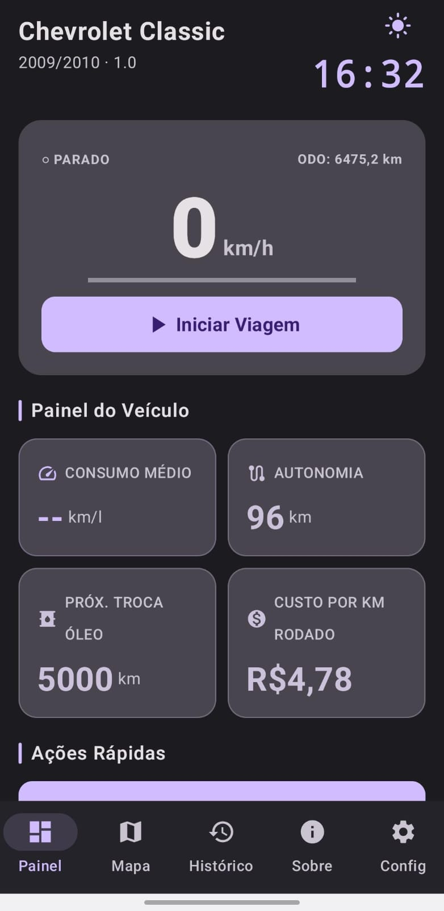
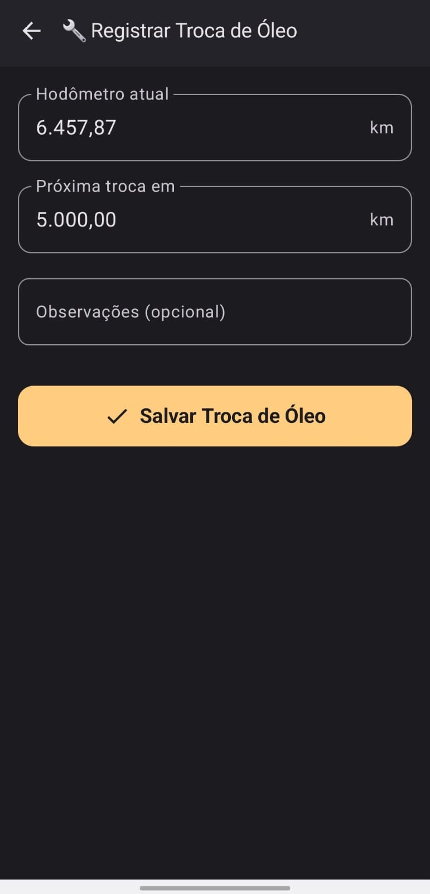
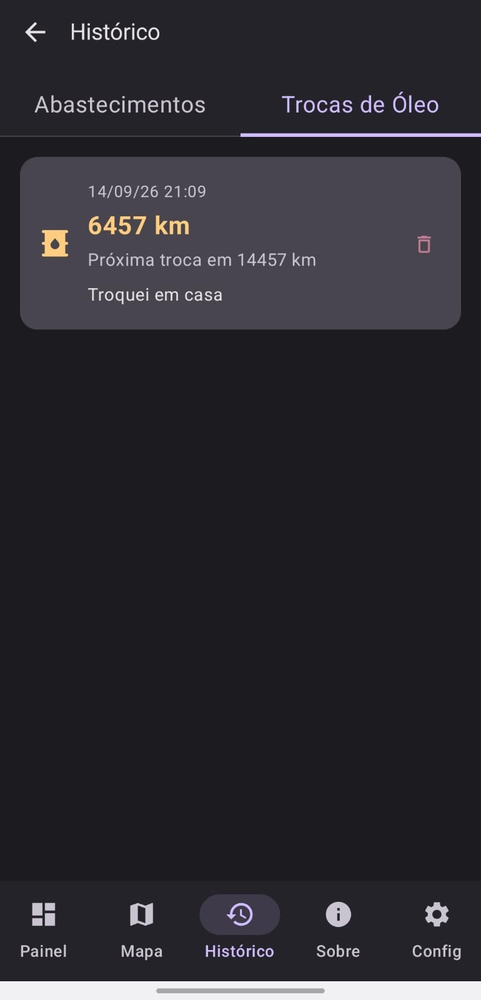
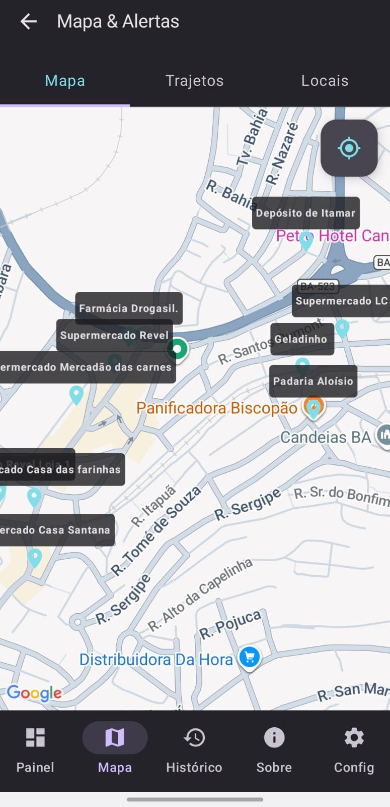
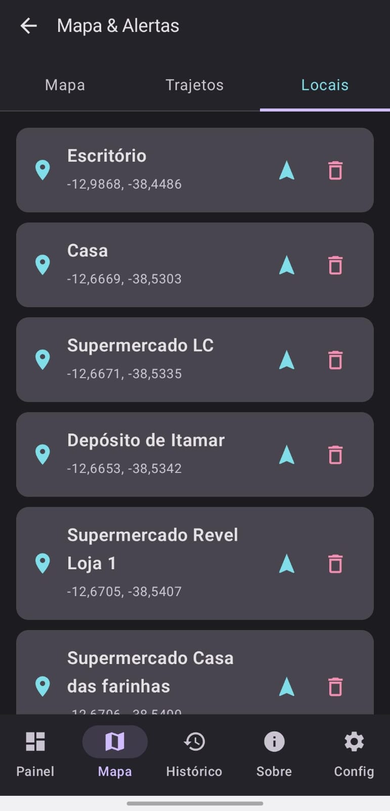
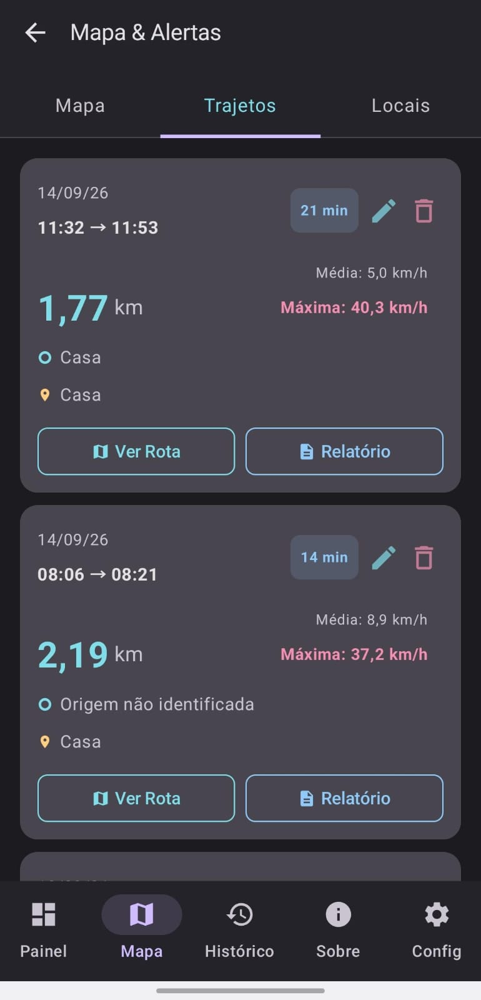
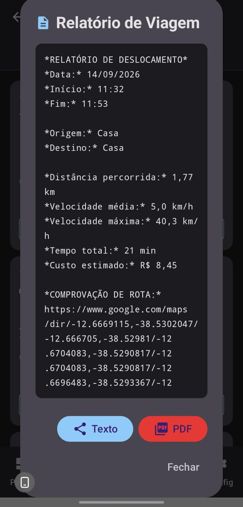
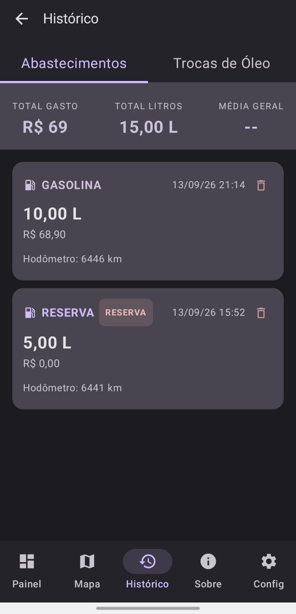
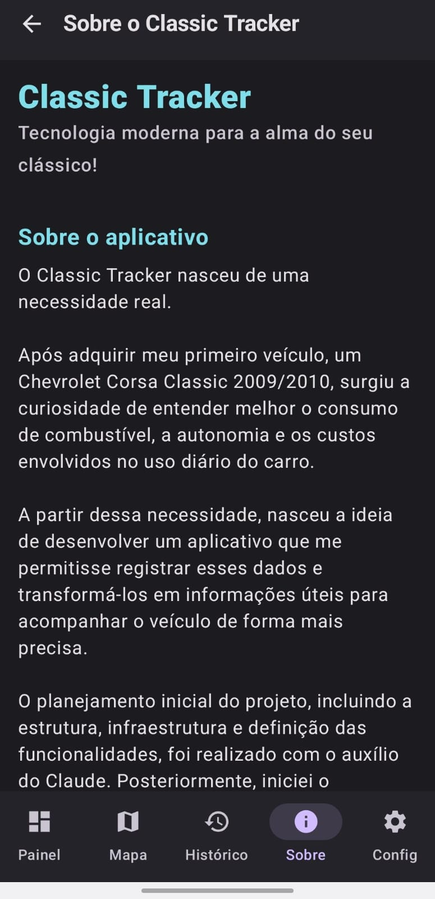
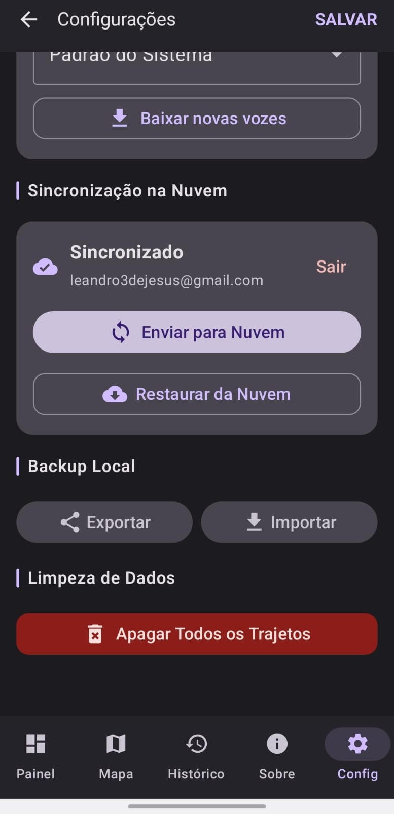

# classicTracker

O **classicTracker** é um aplicativo Android desenvolvido para acompanhar consumo de combustível, autonomia, abastecimentos, rotas GPS, custos por quilômetro e manutenção do veículo.

---

## Sobre o aplicativo

O **classicTracker** nasceu de uma necessidade real.

Após adquirir meu primeiro veículo, um **Chevrolet Corsa Classic 2009/2010**, surgiu a curiosidade de entender melhor o consumo de combustível, a autonomia e os custos envolvidos no uso diário do carro.

A partir dessa necessidade, nasceu a ideia de desenvolver um aplicativo que me permitisse registrar esses dados e transformá-los em informações úteis para acompanhar o veículo de forma mais precisa.

O planejamento inicial do projeto, incluindo estrutura, infraestrutura e definição das funcionalidades, foi realizado com o auxílio do **Claude**. Posteriormente, iniciei o desenvolvimento utilizando o **Gemini**, que também me auxiliou durante as etapas seguintes do projeto.

Foram aproximadamente **cinco meses de uso real, testes, ajustes e melhorias contínuas** até chegar à versão atual, a **2.0**.

Como **engenheiro por trás deste projeto**, pensei em cada funcionalidade com base em situações que realmente enfrento no dia a dia.

Embora ferramentas de Inteligência Artificial tenham sido utilizadas como apoio durante o desenvolvimento, o projeto exigiu conhecimento sobre estrutura de projetos, arquitetura de software, lógica, integração de serviços e, principalmente, uma visão clara de como transformar dados brutos de GPS, abastecimentos e trajetos em informações úteis para o motorista.

O **classicTracker** não nasceu apenas como um exercício de programação. Ele nasceu para resolver um problema real.

---

## Funcionalidades

### Consumo médio

O consumo médio é calculado quando o aplicativo possui dados suficientes para gerar uma média confiável.

Para obter um cálculo mais preciso:

1. Aguarde o veículo entrar na reserva.
2. Clique no botão **[Entrei na Reserva]**.
3. Inicie o rastreamento da rota até o posto de combustível.
4. Ao chegar ao posto, clique em **[Abastecer]**.
5. Selecione o tipo de combustível.
6. Informe o valor total pago.
7. Informe o preço por litro.
8. Insira a quilometragem atual do veículo.
9. Clique em **[Salvar Abastecimento]**.

Com esses dados, o aplicativo consegue acompanhar a distância percorrida e calcular o consumo médio do veículo.

<p align="center">
  
</p>

---

### Autonomia

Sempre que um novo abastecimento é registrado, o aplicativo utiliza os dados disponíveis para calcular uma estimativa da **autonomia do veículo**.

A estimativa considera informações como:

* quantidade de combustível;
* consumo médio;
* histórico de abastecimentos;
* distância percorrida.

---

### Próxima troca de óleo

Ao realizar uma troca de óleo, clique no botão **[Troca de Óleo]**.

Informe a quilometragem prevista para a próxima troca e clique em **[Salvar Troca de Óleo]**.

O aplicativo passa a acompanhar essa quilometragem e ajuda a lembrar quando a próxima manutenção estiver se aproximando.

<p align="center">
  
</p>
<p align="center">
  
</p>

---

### Custo por quilômetro rodado

O cálculo de custo por quilômetro utiliza informações de:

* abastecimentos;
* trajetos registrados;
* distância percorrida;
* valores gastos com combustível.

Quanto mais dados forem registrados no aplicativo, mais consistente será a estimativa.

Para obter melhores resultados, recomenda-se iniciar o rastreamento sempre que utilizar o veículo.

---

### Mapa integrado

O **classicTracker** possui um mapa integrado onde é possível salvar locais personalizados.

Você pode, por exemplo, registrar:

* sua casa;
* trabalho;
* postos de combustível;
* quebra-molas;
* radares;
* buracos na pista;
* pontos de entrega;
* locais importantes do dia a dia.

Cada ponto pode receber um nome personalizado.

Dessa forma, ao se aproximar do local, o aplicativo pode emitir alertas como:

* **“Atenção: quebra-molas à frente.”**
* **“Atenção: buraco na pista à frente.”**
* **“Atenção: radar de 50 km/h à frente.”**
* **“Você chegou em casa.”**

<p align="center">
  
</p>

---

### Avisos e alertas personalizados

Os alertas são gerados com base nos locais salvos pelo próprio usuário.

Por exemplo, costumo cadastrar radares, quebra-molas e buracos localizados em pontos de difícil visualização. Assim, sempre que passo novamente pelo trecho, o aplicativo me lembra antecipadamente.

Isso transforma o mapa em uma ferramenta personalizada de auxílio durante o trajeto.

<p align="center">
  
</p>

---

### Dicas durante o uso

O aplicativo possui dicas que são exibidas enquanto o rastreamento da rota está ativo.

Atualmente, existem **quatro dicas de uso**.

A primeira é exibida aproximadamente nos primeiros **dois minutos de trajeto**, enquanto as demais podem aparecer em intervalos de aproximadamente **20 minutos**.

---

### Rastreamento de rotas

Durante o rastreamento, o aplicativo registra no mapa os locais por onde o veículo passou.

Além do uso pessoal, essa funcionalidade também pode ser útil para quem realiza entregas.

É possível visualizar:

* trajeto realizado;
* distância percorrida;
* locais por onde passou;
* duração da viagem;
* velocidade média;
* velocidade máxima.

Isso permite reconstruir posteriormente todo o percurso realizado.

<p align="center">
  
</p>
---

### Relatório completo de rota e consumo

O aplicativo permite gerar e compartilhar um relatório detalhado contendo informações como:

* origem;
* destino;
* distância percorrida;
* velocidade média;
* velocidade máxima;
* tempo total da viagem;
* custo estimado do trajeto;
* informações relacionadas ao consumo;
* link contendo o trajeto completo registrado.

O relatório pode ser compartilhado diretamente como texto, por exemplo pelo **WhatsApp**, ou exportado como um **documento PDF**.

O link da rota também pode ser utilizado como forma de comprovação do percurso realizado.

<p align="center">
  
</p>

---

## Galeria do aplicativo

<p align="center">  
  
  
</p>

<p align="center">    
  
   
</p>

---

## Backup e sincronização

### Backup na nuvem

Utilize o **Google Sign-In** para manter seus dados vinculados à sua conta.

Em um novo dispositivo, utilize a opção **[Restaurar da Nuvem]** para recuperar seus dados.

<p align="center">
  
</p>

---

### Backup local

O **classicTracker** também permite exportar um arquivo `.json` contendo os principais dados do aplicativo, incluindo:

* configurações;
* abastecimentos;
* trajetos;
* locais salvos.

Esse arquivo pode ser utilizado como backup manual ou transferido para outro dispositivo.

---

## Configuração para desenvolvedores

Para compilar este projeto, será necessário configurar suas próprias chaves e serviços.

### Google Maps API

1. Acesse a [Google Cloud Console](https://console.cloud.google.com/).
2. Crie ou selecione um projeto.
3. Ative a API necessária para utilização do Google Maps.
4. Gere uma chave de API.
5. Adicione a chave ao arquivo `local.properties`:

```properties
MAPS_API_KEY=SUA_CHAVE_AQUI
```

---

### Firebase

1. Acesse o [Firebase Console](https://console.firebase.google.com/).
2. Crie um novo projeto.
3. Adicione um aplicativo Android ao projeto.
4. Baixe o arquivo `google-services.json`.
5. Adicione o arquivo dentro da pasta:

```text
app/
```

6. Ative os seguintes serviços:

* **Authentication**

  * provedor Google;
* **Realtime Database**.
---

## Versionamento

O projeto passou a utilizar controle de versão oficialmente a partir da versão **2.0**.

por conta que eu iniciei o projeto e não queria publicar era algo para ser rápido, Por esse motivo, versões anteriores do **classicTracker** não possuem histórico de commits neste repositório.

---

## Licença e uso

O **classicTracker** é um projeto de uso **gratuito**.

Sinta-se à vontade para utilizar.
---

> **classicTracker — Tecnologia moderna para a alma do seu clássico!**

**Desenvolvido e idealizado por Leandro SJ**
 
